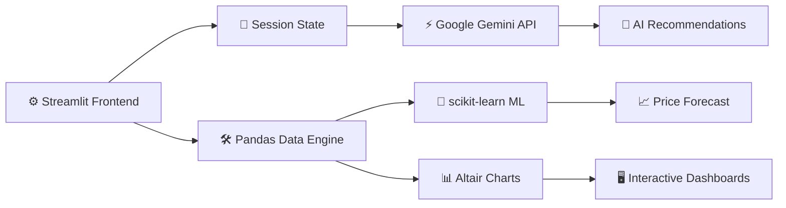

<div align="center">

```
   ╔═══════════════════════════════════════════════════════════╗
   ║  ▓▓▓  M E H E N G A A I   M I T R A   —   UNIT 01  ▓▓▓     ║
   ║  ⚙ GROCERY BUDGET ENGINE ⚙ AI-ASSISTED ⚙ FIELD-TESTED    ║
   ╚═══════════════════════════════════════════════════════════╝
```

# 🛒⚙️ MEHENGAAI MITRA

### `[ SMART GROCERY BUDGET COMPANION — BUILT LIKE A MACHINE ]`

[](https://capstone-project-mirai.streamlit.app)
[](https://github.com/Tanishka-17/capstone_project_mirai)
[](https://python.org)
[](https://ai.google.dev)
[](LICENSE)

```
> "Know your basket before it gets expensive."
```

`═══════════════════════════════════════════════════════════════`

</div>

## ⚙️ SYSTEM OVERVIEW

```
┌──────────────────────────────────────────────────────────────┐
│  UNIT NAME     : Mehengaai Mitra  (Hindi: "Expensive Friend") │
│  FUNCTION      : Grocery price tracking + AI budget planning  │
│  TARGET USER   : Indian households                            │
│  CORE MODULES  : Tracking · Forecasting · Recommendation      │
└──────────────────────────────────────────────────────────────┘
```

**Mehengaai Mitra** is an intelligent grocery budget companion engineered to help Indian households track prices, plan monthly shopping, and make informed purchasing decisions.

### 🎯 PROBLEM STATEMENT — `SPEC SHEET`

> **Hyper-Local Inflation Tracker** — Users log the price of basic grocery items (milk, eggs, rice) over a month. The app plots inflation trends and uses AI to predict the next month's budget requirement.

`═══════════════════════════════════════════════════════════════`

## 🔧 FEATURE MODULES

<div align="center">

| ⚙️ MODULE | 🔩 MODULE | 🛠️ MODULE |
|:---:|:---:|:---:|
| **💰 BUDGET-CTRL** | **🛒 LIST-GEN** | **🏷️ COMPARE-X** |
| Set & track monthly budget | Generate optimized lists | Compare online/local stores |
| **❤️ HEALTH-SAFE** | **📊 FORECAST-ML** | **🌐 LIVE-SEARCH** |
| Diabetes, BP, kidney-aware | Predict next month's costs | Google-grounded prices |
| **🍳 RECIPE-CORE** | **📈 CHART-VIZ** | **🎨 THEME-GOLD** |
| Cook anything, get a list | Altair visualizations | Custom premium design |

</div>

`═══════════════════════════════════════════════════════════════`

## 📸 VISUAL DIAGNOSTICS

<div align="center">

### `[ MODULE_01 ]` 🏠 HOME PAGE


---

### `[ MODULE_02 ]` 💬 CHAT MODE — SHOPPING LIST


---

### `[ MODULE_03 ]` 💬 CHAT MODE — AI RECOMMENDATIONS


---

### `[ MODULE_04 ]` 📊 DASHBOARD & ANALYTICS


</div>

`═══════════════════════════════════════════════════════════════`

## 🏗️ MACHINE ARCHITECTURE



`═══════════════════════════════════════════════════════════════`

<div align="center">

```
   ╔═══════════════════════════════════════════════════════════╗
   ║   END OF UNIT SPECIFICATION  ·  RUN: streamlit run app.py ║
   ╚═══════════════════════════════════════════════════════════╝
```

</div>
