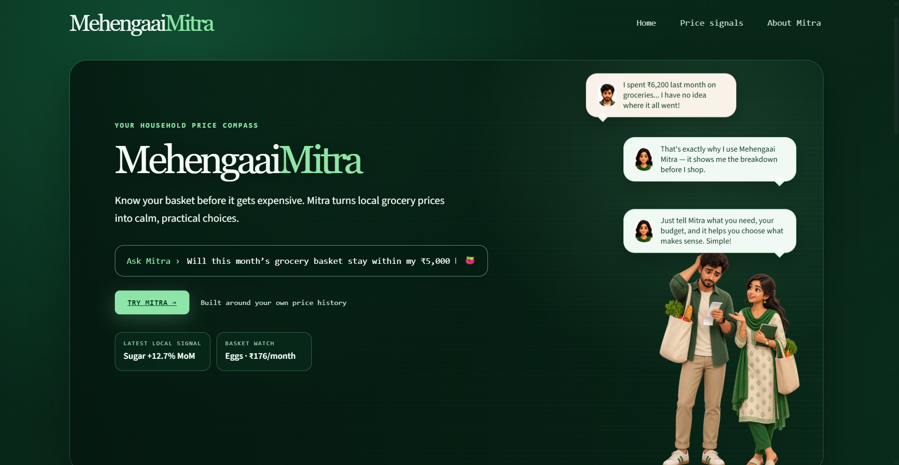
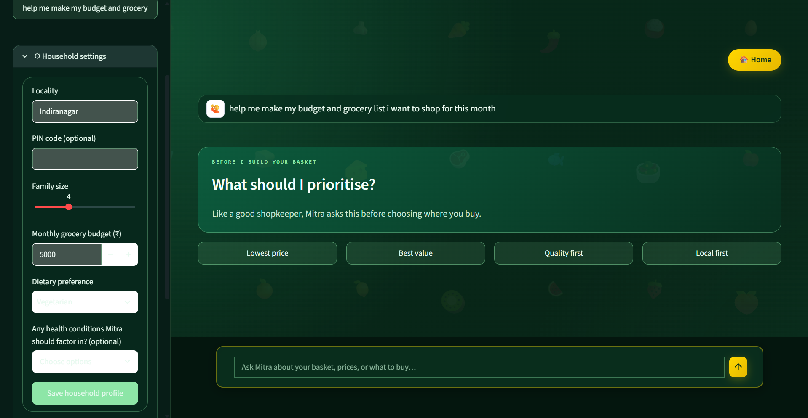
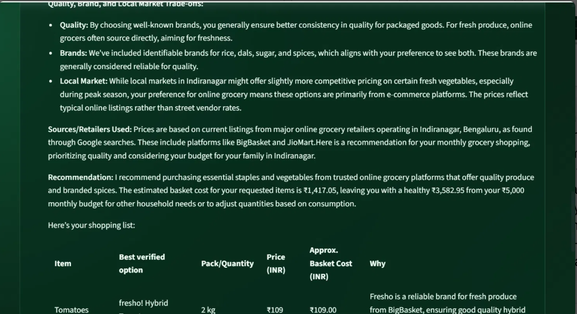
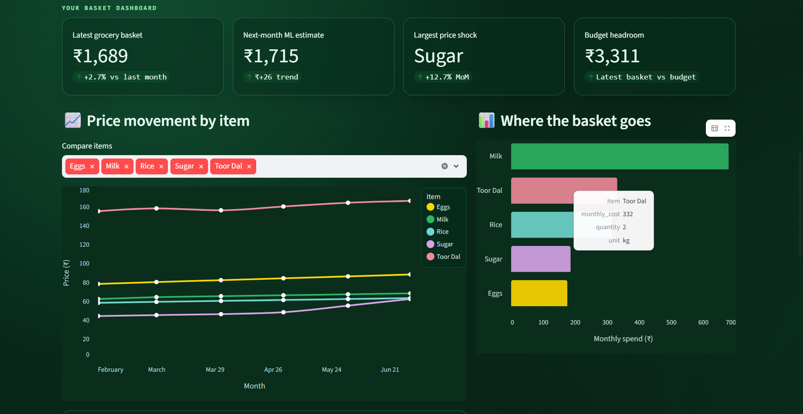

# 📈 Mehengaai Mitra
### Your Smart Grocery Budget Companion

> *"Know your basket before it gets expensive."*

---

## 📖 About

**Mehengaai Mitra** (Hindi for *"Expensive Friend"*) is an intelligent grocery budget companion that helps Indian households track prices, plan monthly shopping, and make informed purchasing decisions.

### Problem Statement
> **Hyper-Local Inflation Tracker** — Users log the price of basic grocery items over a month. The app plots inflation trends and uses AI to predict the next month's budget requirement.

---

## ✨ Features

| 💰 Budget Management | 🛒 Smart Lists | 🏷️ Brand Comparison |
|:---:|:---:|:---:|
| Set & track monthly budget | Generate optimized lists | Compare online/local prices |
| ❤️ Health Planning | 📊 ML Forecasting | 🌐 Real-Time Search |
| Diabetes, BP, kidney-aware | Predict next month's costs | Google-grounded price search |

---

## 📸 Screenshots

| Home Page | Chat Mode |
|:---:|:---:|
|  |  |
| **AI Recommendations** | **Dashboard** |
|  |  |

---

## 🏗️ Architecture
