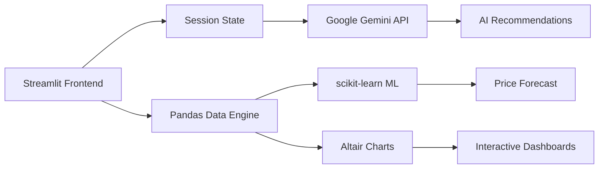

**Smart Grocery Budget Companion**

*"Know your basket before it gets expensive."*

**🔗 [Try the live app](https://capstoneprojectmirai-lbcekpwcaxw2otq4kr7ven.streamlit.app/)**

 

## About

**Mehengaai Mitra** (Hindi for *"Expensive Friend"*) is an intelligent grocery budget companion that helps Indian households track prices, plan monthly shopping, and make informed purchasing decisions.

**Problem statement — Hyper-Local Inflation Tracker:** Users log the price of basic grocery items (milk, eggs, rice) over a month. The app plots inflation trends and uses AI to predict the next month's budget requirement.

 

## Features

| ⚙️ | | ⚙️ | | ⚙️ |
|:---:|---|:---:|---|:---:|
| **💰 Budget Management** Set & track monthly budget | | **🛒 Smart Lists** Generate optimized lists | | **🏷️ Brand Compare** Compare online/local stores |
| **❤️ Health Planning** Diabetes, BP, kidney-aware | | **📊 ML Forecast** Predict next month's costs | | **🌐 Real-Time Search** Google-grounded prices |
| **🍳 Recipe-Based** Cook anything, get a list | | **📈 Interactive Charts** Altair visualizations | | **🎨 Gold-Green Theme** Custom premium design |

 

## Screenshots

**Home Page**

**Chat Mode — Shopping List**

**Chat Mode — AI Recommendations**

**Dashboard & Analytics**

 

## Architecture

 

⚙️ *Run it locally with* `streamlit run app.py`

